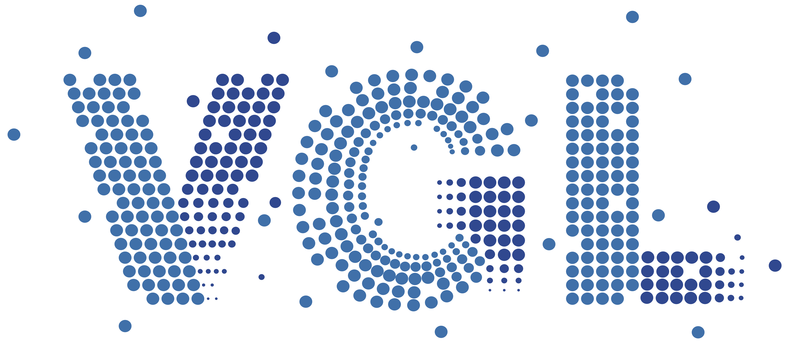
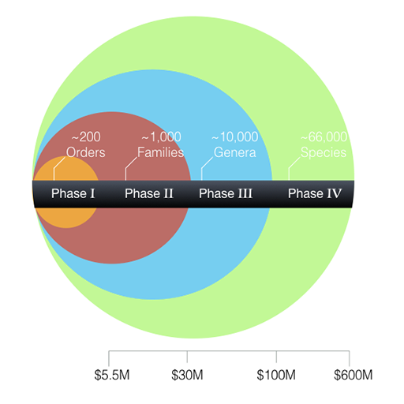
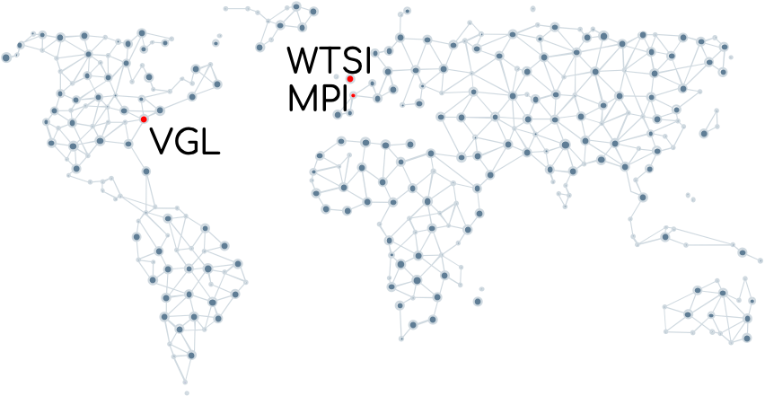
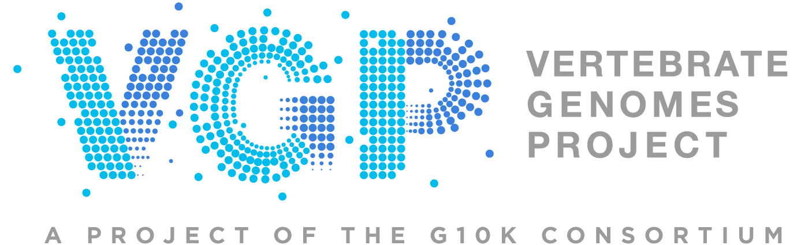
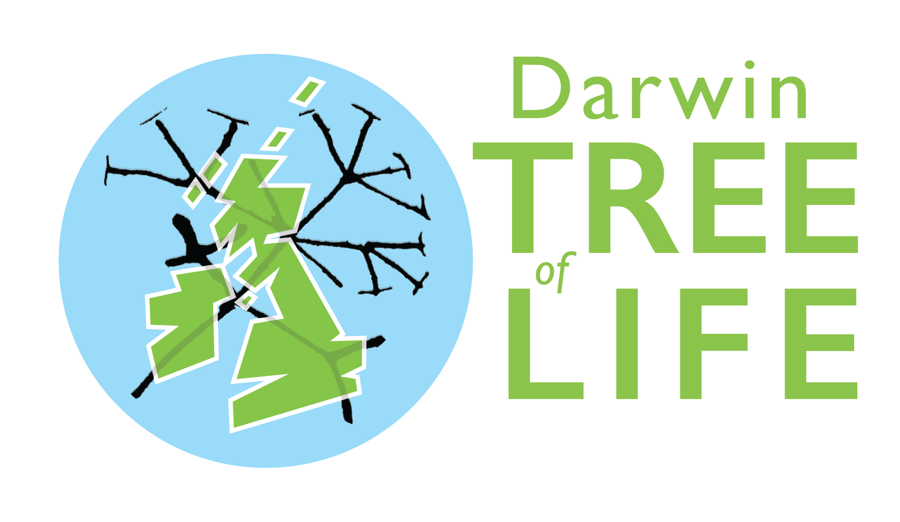
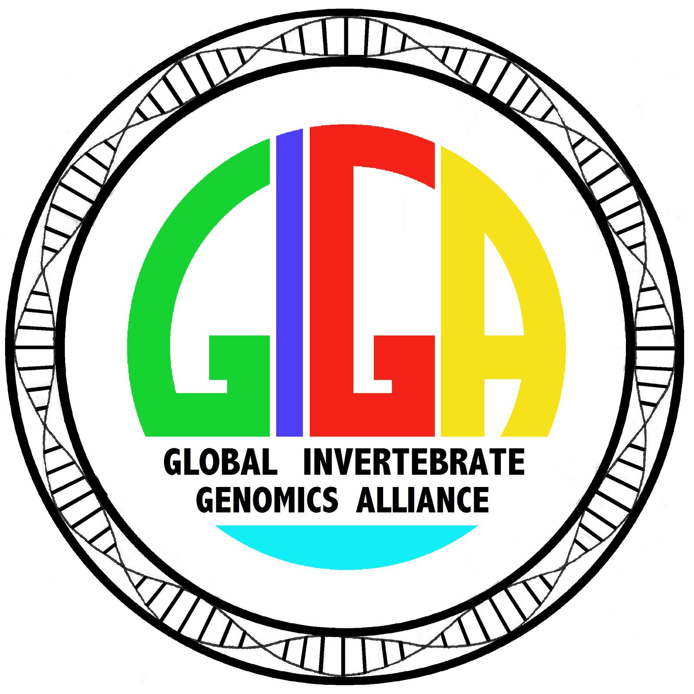
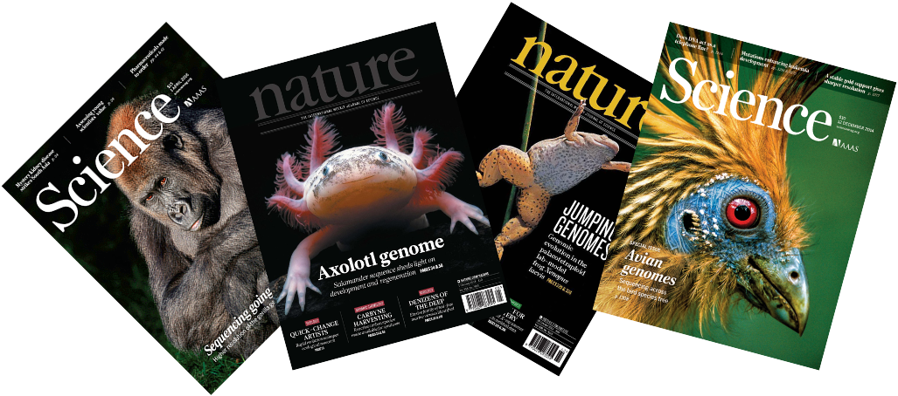

```{r,include=FALSE}
suppressPackageStartupMessages(require(knitr))
knitr::opts_chunk$set(echo = TRUE, tidy = T)
```

```{r, results='asis',include=TRUE,echo=FALSE}
if(params$isSlides != "yes"){
  cat("# Genome Assembly (session1)

---
"    
  )
  
}

```

# An introduction to genome assembly
#### Principles and practicalities of assembling, evaluating and using a reference genome

<div width="40%">
Giulio Formenti, Ph.D.<br/>
Laboratory of Neurogenetics of Language<br/>
Vertebrate Genome Laboratory<br/>
The Rockefeller University<br/>
<a href="mailto:gformenti@rockefeller.edu">gformenti@rockefeller.edu</a>
</div>

__In collaboration with the Vertebrate Genomes Laboratory__

_March 22nd & 25th \- Monday & Thursday_




---
## Overview

- [Introduction to Conda](https://docs.conda.io/projects/conda/en/latest/user-guide/getting-started.html)
- [Introduction to Snakemake](https://snakemake.readthedocs.io/en/stable/)

---
## Materials

- [GEP - Genome evaluation pipeline](https://git.imp.fu-berlin.de/cmazzoni/genome_evaluation_snakemake)
- Path on RU HPC to test data: /fakepath/to/data

---
## Course materials

?? this slide just shows where thye can get the course content from the download. You do not need to populate these directories. It will be made during compilation??

Once the zip file in unarchived. All presentations as HTML slides and pages, their R code and HTML practical sheets will be available in the directories underneath.

* **r_course/presentations/slides/**
Presentations as an HTML slide show.
* **r_course/presentations/singlepage/** 
Presentations as an HTML single page.
* **r_course/presentations/r_code/**
R code in presentations.
* **r_course/exercises/**
Practicals as HTML pages. 
* **r_course/answers/**
Practicals with answers as HTML pages and R code solutions. 


---
## The Vertebrate Genomes Project




<center>
[VGP website](https://vertebrategenomesproject.org/)\

</center>

---
## Many international endeavours






---
## Why sequencing the DNA

_«A knowledge of sequences could contribute much <br/>
to our understanding of living matter»_

Frederick Sanger, 1980


