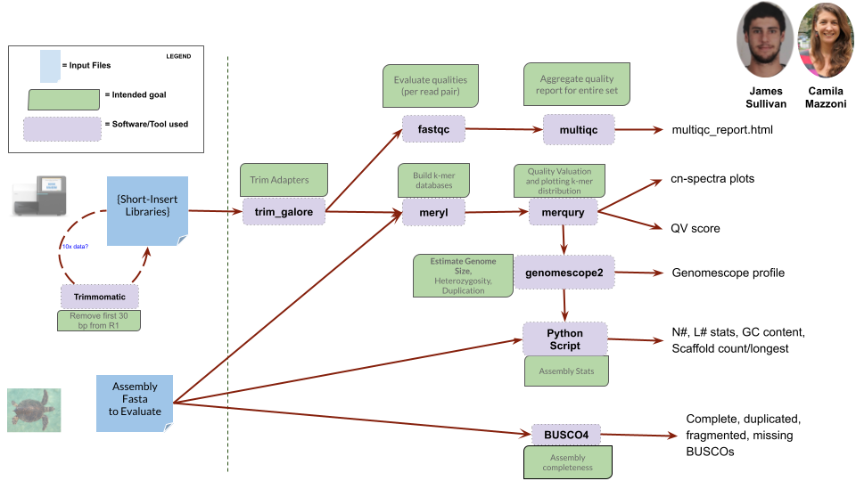

```{r,include=FALSE}
suppressPackageStartupMessages(require(knitr))
knitr::opts_chunk$set(echo = TRUE, tidy = T)
```

<div style="font-size:30px;background-image: url('../imgs/bg.png'); background-repeat:no-repeat; background-size: 796px; text-align:center; height=600px; padding:200px 0 400px 0" width=100%><b>Genome assembly:<br/>Evaluation</b></div>

---
## Synopsis

<ol>
<li>Estimation of genome parameters (Genomescope)</li>
<li>General assembly metrics (contiguity, quality)</li>
<li>Assembly completeness (BUSCO)</li>
<li>Structural accuracy</li>
<li>Kmer multiplicity (false duplications, missing kmers)</li>
<li>Switch rates</li>
<li>WGA (D-Genies, Mummer, Cactus)</li>
<ol>

---
## 1. Genome parameters

Unrivalled software for assembly-free estimates is Genomescope (v2.0, 2020)


---
## What is a genome assembly?

A genome assembly is the entire genomic sequence derived through a _de novo_ (i.e. reference-free) assembly process of the raw sequencing reads and released by the curators of the genome in the database upon publication.

- Until now a single ‘reference’ individual or pooled individuals in a single reference.
- Haploid.
- Sometimes alternative alleles reported as variants.
- Haplotigs were often completely shuffled as it is unfeasible to determine long blocks of haplotype with NGS.
- Sometimes more than one assembly is present.

---
## The primary assembly

The Primary Assembly constitutes what Genbank curators consider the most up-to-date source for the genomic sequence for this reference.

When available, this is the first result being shown.

Picking a random human gene, the Primary Assembly normally refers to the human genome assembly ‘GRCh38’ (Genome Reference Consortium human build n. 38), the latest release of the long list of high-quality assemblies for the human genome generated since 2001.


---
## The primary assembly


---
## 2. Contiguity


---
## 2. Contiguity


---
## 2. Quality (QV)

<div style="text-align:center">


</div>

---
## 3. BUSCO scores

<div style="text-align:center">

</div>

---
## 4. Structural accuracy

<div style="text-align:center">

</div>

---
## 5. Kmer multiplicity

<div style="text-align:center">

</div>

---
## 5. Kmer multiplicity

<div style="text-align:center">

</div>

---
## 6. Switch error rate

<div style="text-align:center">


</div>

---
## Many tools, one pipeline

